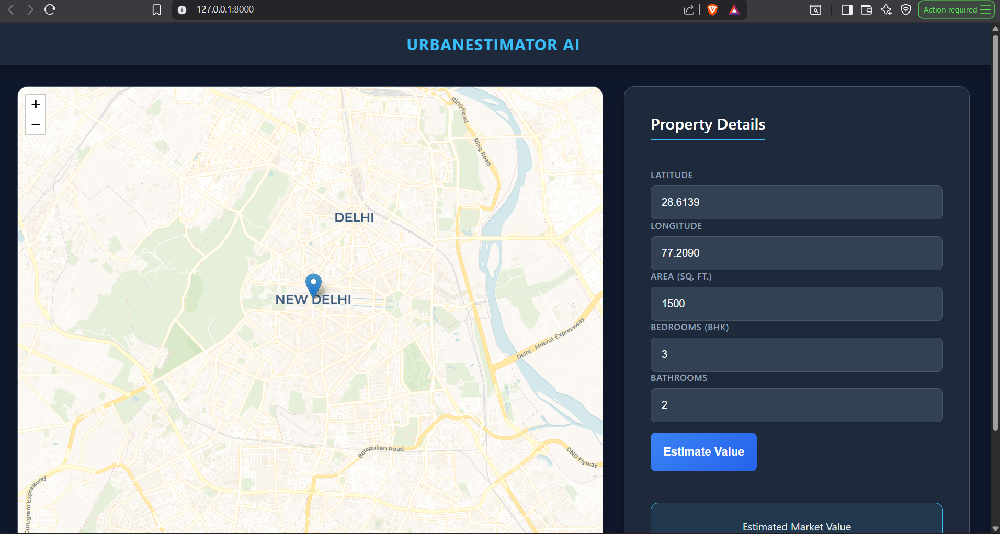
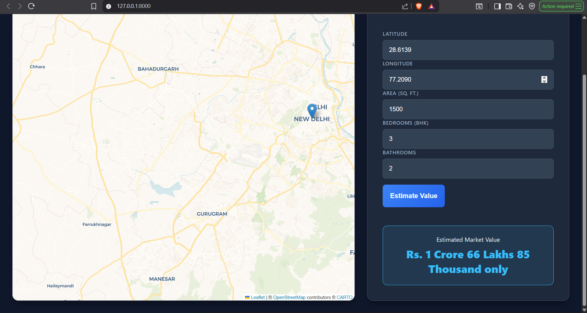

🏡 UrbanEstimator - AI-Powered Real Estate Valuation

UrbanEstimator is a machine learning-powered web application that predicts real estate prices in New Delhi with 91% accuracy. It uses a Random Forest Regressor trained on 7,000+ property listings to provide instant valuations based on location, area, and amenities.

🌟 Features

High-Accuracy Model: Trained on real market data using Random Forest Regression.

Interactive Map: Drag-and-drop pin selection using Leaflet.js to capture precise Latitude/Longitude.

Smart Feature Engineering: Automatically calculates Bath-to-Bed Ratio to assess luxury levels.

Indian Currency Formatting: Automatically formats large numbers into Crores and Lakhs (e.g., "Rs. 2 Crore 50 Lakhs").

Modern UI: Dark-themed, responsive interface.

📸 Screenshots

(, )

Landing Page

Prediction Result

🛠️ Tech Stack

Frontend: HTML5, CSS3, JavaScript, Leaflet.js (Maps)

Backend: Python, FastAPI, Uvicorn

Machine Learning: Scikit-Learn, Pandas, NumPy, Joblib

Algorithm: Random Forest Regressor (R2 Score: 0.91)

🚀 Installation & Setup

1. Clone the Repository

git clone [https://github.com/YourUsername/UrbanEstimator.git](https://github.com/YourUsername/UrbanEstimator.git)
cd UrbanEstimator

2. Create Virtual Environment

python -m venv .venv
# Windows
.venv\Scripts\activate
# Mac/Linux
source .venv/bin/activate

3. Install Dependencies

pip install -r requirements.txt

4. Run the Application

uvicorn app:app --reload

Open your browser at http://127.0.0.1:8000

🧠 Model Training

To retrain the model with new data:

Place your dataset as house_data.csv in the root folder.

Run the training pipeline:

python train_model.py

This performs Data Cleaning, Outlier Removal, Feature Engineering, and Grid Search tuning before saving the new house_model.pkl.

🤝 Contributing

Fork the Project

Create your Feature Branch (git checkout -b feature/AmazingFeature)

Commit your Changes (git commit -m 'Add some AmazingFeature')

Push to the Branch (git push origin feature/AmazingFeature)

Open a Pull Request

📜 License

Distributed under the MIT License. See LICENSE for more information.